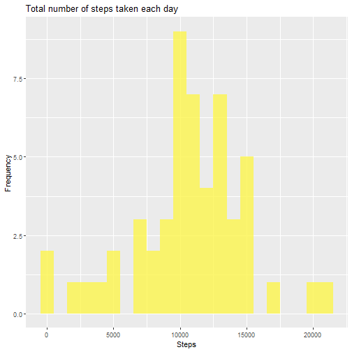
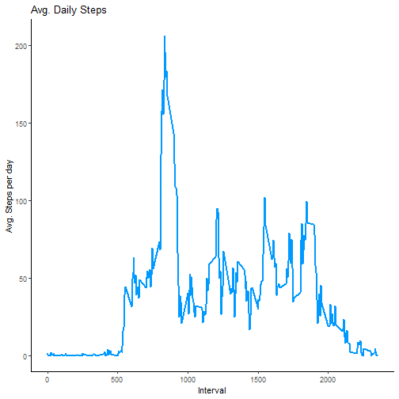
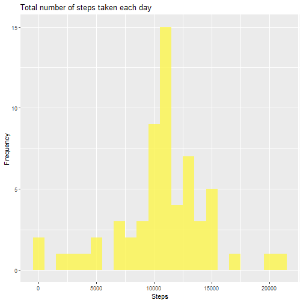
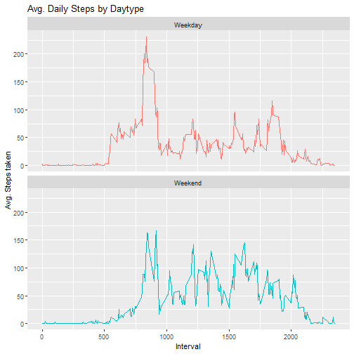

## Loading and preprocessing the data

- Loading package


```r
library(tidyverse)
```

```
## -- Attaching packages ------------------------------------------------------------------------------------------------ tidyverse 1.3.1 --
```

```
## v ggplot2 3.3.3     v purrr   0.3.4
## v tibble  3.1.2     v dplyr   1.0.7
## v tidyr   1.1.3     v stringr 1.4.0
## v readr   1.4.0     v forcats 0.5.1
```

```
## -- Conflicts --------------------------------------------------------------------------------------------------- tidyverse_conflicts() --
## x dplyr::filter() masks stats::filter()
## x dplyr::lag()    masks stats::lag()
```

```r
library(ggplot2)
library(data.table)
```

```
## data.table 1.14.0 using 4 threads (see ?getDTthreads).  Latest news: r-datatable.com
```

```
## 
## Attaching package: 'data.table'
```

```
## The following objects are masked from 'package:dplyr':
## 
##     between, first, last
```

```
## The following object is masked from 'package:purrr':
## 
##     transpose
```

```r
library(lubridate)
```

```
## 
## Attaching package: 'lubridate'
```

```
## The following objects are masked from 'package:data.table':
## 
##     hour, isoweek, mday, minute, month, quarter, second, wday, week, yday, year
```

```
## The following objects are masked from 'package:base':
## 
##     date, intersect, setdiff, union
```

- Download data

```r
dataurl <- "https://d396qusza40orc.cloudfront.net/repdata%2Fdata%2Factivity.zip"
path <- getwd()
download.file(dataurl, file.path(path, "datafiles.zip"))
unzip(zipfile = "datafiles.zip")
```
## Reading data


```r
act.dt <- read.csv("./activity.csv")
```
## What is mean total number of steps taken per day?
- Calculate the total number of steps taken per day


```r
step_by_day <- act.dt %>%
      group_by(date) %>%
      summarize(steps=sum(steps))
head(step_by_day, 10)
```

```
## # A tibble: 10 x 2
##    date       steps
##    <chr>      <int>
##  1 2012-10-01    NA
##  2 2012-10-02   126
##  3 2012-10-03 11352
##  4 2012-10-04 12116
##  5 2012-10-05 13294
##  6 2012-10-06 15420
##  7 2012-10-07 11015
##  8 2012-10-08    NA
##  9 2012-10-09 12811
## 10 2012-10-10  9900
```
- If you do not understand the difference between a histogram and a barplot, research the difference between them. Make a histogram of the total number of steps taken each day


```r
ggplot(step_by_day, aes(x = steps)) +
      geom_histogram(fill = "#FCF54C", alpha = 0.8, binwidth = 1000) +
      labs(title = "Total number of steps taken each day", x = "Steps", y = "Frequency")
```

```
## Warning: Removed 8 rows containing non-finite values (stat_bin).
```



- Calculate and report the mean and median of the total number of steps taken per day

```r
print(paste0('Mean steps is: ', mean(step_by_day$steps, na.rm = T)))
```

```
## [1] "Mean steps is: 10766.1886792453"
```

```r
print(paste0('Median steps is: ', median(step_by_day$steps, na.rm = T)))
```

```
## [1] "Median steps is: 10765"
```
## What is the average daily activity pattern?
- Make a time series plot of the 5-minute interval (x-axis) and the average number of steps taken, averaged across all days 


```r
interval.dt <- act.dt %>%
      group_by(interval) %>%
      summarize(steps = mean(steps, na.rm = T))
head(interval.dt, 10)
```

```
## # A tibble: 10 x 2
##    interval  steps
##       <int>  <dbl>
##  1        0 1.72  
##  2        5 0.340 
##  3       10 0.132 
##  4       15 0.151 
##  5       20 0.0755
##  6       25 2.09  
##  7       30 0.528 
##  8       35 0.868 
##  9       40 0     
## 10       45 1.47
```

```r
ggplot(interval.dt, aes(x = interval , y = steps)) + 
      geom_line(color = "#0099FF", size = 0.8) + 
      theme_classic()+
      labs(title = "Avg. Daily Steps", x = "Interval", y = "Avg. Steps per day")
```



- Which 5-minute interval, on average across all the days in the dataset, contains the maximum number of steps?


```r
print(paste0('Maximum Steps occurs in interval ', filter(interval.dt, steps == max(steps))$interval))
```

```
## [1] "Maximum Steps occurs in interval 835"
```

## Imputing missing values
- Calculate and report the total number of missing values in the dataset

```r
nrow(filter(act.dt, is.na(steps)))
```

```
## [1] 2304
```

- Devise a strategy for filling in all of the missing values in the dataset. The strategy does not need to be sophisticated. For example, you could use the mean/median for that day, or the mean for that 5-minute interval, etc.


```r
act.0na <- act.dt
act.0na <- group_by(act.dt, interval) %>%
      mutate(steps = ifelse(is.na(steps), mean(steps, na.rm = TRUE), steps))
```
- Create a new dataset that is equal to the original dataset but with the missing data filled in.


```r
write.table(act.0na, file = "tidydataset.txt", row.names = FALSE)
```
- Make a histogram of the total number of steps taken each day and Calculate and report the mean and median total number of steps taken per day. Do these values differ from the estimates from the first part of the assignment? What is the impact of imputing missing data on the estimates of the total daily number of steps?


```r
step_by_day <- act.0na %>%
      group_by(date) %>%
      summarize(steps=sum(steps, na.rm = T))

ggplot(step_by_day, aes(x = steps)) +
      geom_histogram(fill = "#FCF54C", alpha = 0.8, binwidth = 1000) +
      labs(title = "Total number of steps taken each day", x = "Steps", y = "Frequency")
```



```r
print(paste0('Mean steps is: ', mean(step_by_day$steps)))
```

```
## [1] "Mean steps is: 10766.1886792453"
```

```r
print(paste0('Median steps is: ', median(step_by_day$steps)))
```

```
## [1] "Median steps is: 10766.1886792453"
```


## Are there differences in activity patterns between weekdays and weekends?
- Create a new factor variable in the dataset with two levels – “weekday” and “weekend” indicating whether a given date is a weekday or weekend day.

```r
act.0na$date <- ymd(act.0na$date)
act.0na["Day_of_Week"] <- weekdays(act.0na$date)

act.0na["Day"] = ifelse(act.0na["Day_of_Week"] == "Sunday" | act.0na["Day_of_Week"] == "Saturday",
                        "Weekend", "Weekday")
act.0na$Day = as.factor(act.0na$Day)
head(act.0na, 10)
```

```
## # A tibble: 10 x 5
## # Groups:   interval [10]
##     steps date       interval Day_of_Week Day    
##     <dbl> <date>        <int> <chr>       <fct>  
##  1 1.72   2012-10-01        0 Monday      Weekday
##  2 0.340  2012-10-01        5 Monday      Weekday
##  3 0.132  2012-10-01       10 Monday      Weekday
##  4 0.151  2012-10-01       15 Monday      Weekday
##  5 0.0755 2012-10-01       20 Monday      Weekday
##  6 2.09   2012-10-01       25 Monday      Weekday
##  7 0.528  2012-10-01       30 Monday      Weekday
##  8 0.868  2012-10-01       35 Monday      Weekday
##  9 0      2012-10-01       40 Monday      Weekday
## 10 1.47   2012-10-01       45 Monday      Weekday
```

- Make a panel plot containing a time series plot of the 5-minute interval (x-axis) and the average number of steps taken, averaged across all weekday days or weekend days (y-axis).

```r
interval.dt <- act.0na %>%
      group_by(Day, interval) %>%
      summarize(steps = mean(steps, na.rm = T))
```

```
## `summarise()` has grouped output by 'Day'. You can override using the `.groups` argument.
```

```r
head(interval.dt, 10)
```

```
## # A tibble: 10 x 3
## # Groups:   Day [1]
##    Day     interval  steps
##    <fct>      <int>  <dbl>
##  1 Weekday        0 2.25  
##  2 Weekday        5 0.445 
##  3 Weekday       10 0.173 
##  4 Weekday       15 0.198 
##  5 Weekday       20 0.0990
##  6 Weekday       25 1.59  
##  7 Weekday       30 0.693 
##  8 Weekday       35 1.14  
##  9 Weekday       40 0     
## 10 Weekday       45 1.80
```

```r
ggplot(interval.dt, aes(x = interval , y = steps, color = Day)) + 
      geom_line() + 
      theme(legend.position = "none") +
      labs(title = "Avg. Daily Steps by Daytype", x = "Interval", y = "Avg. Steps taken") +
      facet_wrap(~Day , ncol = 1, nrow = 2)
```




